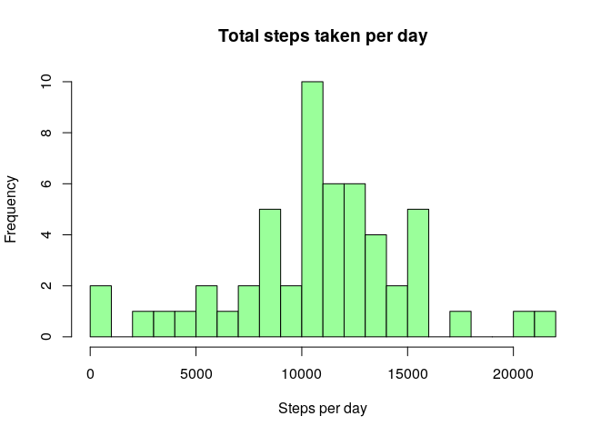
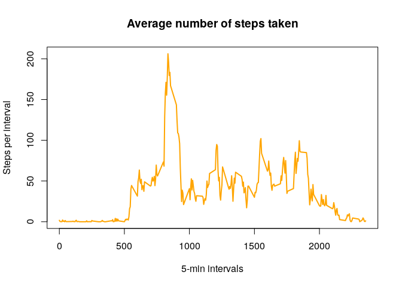
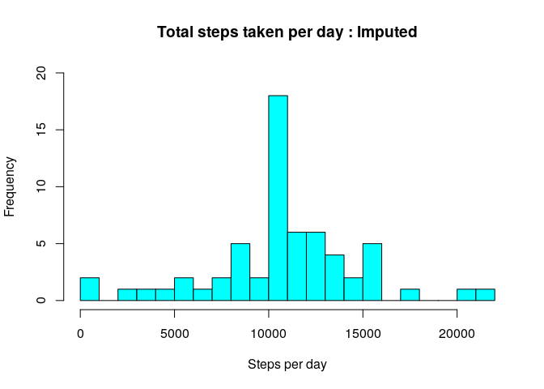
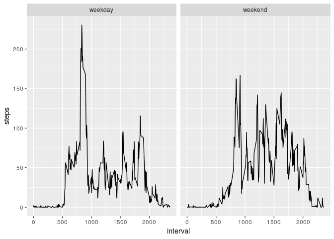

## Loading and preprocessing the data


```r
if(!file.exists('activity.csv')){
  unzip('activity.zip')
}
df<-read.csv("activity.csv")
```

## mean total number of steps taken per day?

### Total number of steps taken per day

```r
steps.day<-aggregate(steps ~ date, data = df, FUN = sum, na.rm = TRUE)
```


### Histogram of the total number of steps taken each day

```r
hist(steps.day$steps, breaks = 20, main= "Total steps taken per day", xlab = "Steps per day",
     col = "palegreen1" )
```

<!-- -->


### Mean and median of total number of steps per day

```r
mean(steps.day$steps)
```

```
## [1] 10766.19
```

```r
 median(steps.day$steps)
```

```
## [1] 10765
```


## What is the average daily activity pattern?

### Time series plot of the 5-minute interval  and the average number of steps taken, averaged across all days 

```r
steps.int<- aggregate(steps~interval, data = df, FUN = mean, na.rm = TRUE)

plot(steps.int, type = "l", main = "Average number of steps taken", xlab = "5-min intervals", 
     ylab = "Steps per interval", col = "orange", lwd = 2)
```

<!-- -->

### 5-minute interval which contains the maximum number of steps?

```r
max_int<- steps.int[which.max(steps.int$steps), ]
```

The 835 th interval conatins 207 steps which is the maximum.


## Imputing missing values

### Total number of missing values in the dataset 

```r
sum(is.na(df$steps))
```

```
## [1] 2304
```
### Strategy for filling in all of the missing values in the dataset. 
I propose using the mean of the intervals 


### New dataset with missing values filled in

```r
#Split the data
df_na<- df[is.na(df$steps),]
df_na_not<- df[!is.na(df$steps),]

#Fill in the missing data
for (i in df_na$steps) {
        if(df_na$interval == steps.int$interval)  df_na$steps = steps.int$steps
}

#Bind into a new dataframe
df1<- rbind(df_na,df_na_not)

#No. of missing values in newdata frame
sum(is.na(df1$steps))
```

```
## [1] 0
```


### Histogram of the total number of steps taken each day 

```r
steps.day1<-aggregate(steps ~ date, data = df1, FUN = sum)

hist(steps.day1$steps, breaks = 20, main= "Total steps taken per day : Imputed", xlab = "Steps per day",
     col = "cyan", ylim = c(0,20) )
```

<!-- -->

### Mean and median total number of steps taken per day.


```r
 mean(steps.day1$steps)
```

```
## [1] 10766.19
```

```r
 median(steps.day1$steps)
```

```
## [1] 10766.19
```
There is no real difference between the means and medians of the original data frame versus the imputed data frame.

###Impact of imputing missing data on the estimates of the total daily number of steps


```r
summary(steps.day)
```

```
##          date        steps      
##  2012-10-02: 1   Min.   :   41  
##  2012-10-03: 1   1st Qu.: 8841  
##  2012-10-04: 1   Median :10765  
##  2012-10-05: 1   Mean   :10766  
##  2012-10-06: 1   3rd Qu.:13294  
##  2012-10-07: 1   Max.   :21194  
##  (Other)   :47
```

```r
summary(steps.day1)
```

```
##          date        steps      
##  2012-10-01: 1   Min.   :   41  
##  2012-10-02: 1   1st Qu.: 9819  
##  2012-10-03: 1   Median :10766  
##  2012-10-04: 1   Mean   :10766  
##  2012-10-05: 1   3rd Qu.:12811  
##  2012-10-06: 1   Max.   :21194  
##  (Other)   :55
```
There is variation in the quantiles shown by the summary of the two data sets.


## Are there differences in activity patterns between weekdays and weekends?

### Whether a given date is a weekday or weekend day.


```r
#Converting to date
df1$days<- weekdays(as.Date(df1$date, format = "%Y-%m-%d"))

#whether weekday or weekend
df1$day.type<- ifelse(df1$days == "Saturday" | df1$days == "Sunday" , "weekend", "weekday")
```
### Panel plot containing a time series plot of the 5-minute interval 


```r
steps.day.type<-aggregate(steps~interval + day.type, data = df1, FUN = mean)
library(ggplot2)
ggplot(aes(x=interval,y=steps),data= steps.day.type)+geom_line()+facet_wrap(~steps.day.type$day.type)
```

<!-- -->

